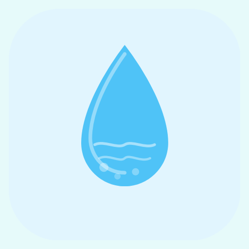

<p align="center">
  
</p>

<h1 align="center">HydroMate - Water Reminder & Tracker</h1>

<p align="center">
  A comprehensive wellness app for hydration tracking, sleep management, and focus sessions built with React Native and Expo.
</p>

<p align="center">
  
  
  
  
</p>

---

## Features

### 💧 Hydration Tracking
- Daily water intake tracking with customizable goals
- Multiple beverage types support
- Weather-based hydration recommendations
- Detailed statistics and history
- Smart reminders with custom notification sounds

### 😴 Sleep Management
- Sleep tracking and scoring
- Bedtime reminders
- Sleep debt calculator
- Relaxing sleep sounds
- Sleep-hydration correlation insights

### 🎯 Focus & Productivity
- Pomodoro timer
- Deep work sessions
- Focus goals and history tracking
- App blocker functionality
- Break reminders

### 🏆 Gamification
- Achievement system
- Virtual pet companion
- Social features and friends
- Eco-impact tracking

### 🌐 Localization
- Multi-language support via i18n-js
- RTL support ready

---

## Tech Stack

| Category | Technology |
|----------|------------|
| Framework | [Expo](https://expo.dev/) (SDK 54) |
| UI | React Native 0.81.5 |
| Language | TypeScript 5.9 |
| Navigation | Expo Router (file-based routing) |
| State Management | [Zustand](https://zustand-demo.pmnd.rs/) |
| Storage | AsyncStorage |
| Animations | React Native Reanimated |
| Validation | Yup |
| Testing | Jest + jest-expo |
| Linting | ESLint + Prettier |

---

## Project Structure

```
├── app/                    # File-based routing (Expo Router)
│   ├── (tabs)/            # Tab navigation screens
│   │   ├── index.tsx      # Home/Water tracking
│   │   ├── sleep.tsx      # Sleep tracking
│   │   ├── focus.tsx      # Focus sessions
│   │   ├── history.tsx    # History view
│   │   └── settings.tsx   # App settings
│   └── *.tsx              # Modal and detail screens
├── components/            # Reusable UI components
│   ├── ui/               # Base UI components
│   ├── WaterProgress/    # Water tracking components
│   ├── WeatherCard/      # Weather display
│   └── ...
├── store/                # Zustand state stores
├── hooks/                # Custom React hooks
├── services/             # API and business logic
├── utils/                # Helper functions
├── i18n/                 # Internationalization
├── interfaces/           # TypeScript interfaces
├── schemas/              # Validation schemas
├── styles/               # Shared styles
├── modals/               # Modal components
└── assets/               # Images, fonts, sounds
```

---

## Getting Started

### Prerequisites

- Node.js 18+ 
- npm or yarn
- [Expo CLI](https://docs.expo.dev/get-started/installation/)
- iOS Simulator (macOS) or Android Emulator

### Installation

1. **Clone the repository**
   ```bash
   git clone <repository-url>
   cd Water-Reminder-Sleep-Focus
   ```

2. **Install dependencies**
   ```bash
   npm install
   ```

3. **Set up environment variables**
   ```bash
   cp .env.example .env
   # Edit .env with your configuration
   ```

4. **Start the development server**
   ```bash
   npm start
   ```

5. **Run on device/emulator**
   - Press `a` for Android
   - Press `i` for iOS
   - Press `w` for Web
   - Scan QR code with Expo Go app

---

## Available Scripts

| Command | Description |
|---------|-------------|
| `npm start` | Start Expo development server |
| `npm run android` | Run on Android device/emulator |
| `npm run ios` | Run on iOS simulator |
| `npm run web` | Run in web browser |
| `npm run lint` | Run ESLint |
| `npm run prettier:write` | Format code with Prettier |
| `npm test` | Run tests |
| `npm run test:watch` | Run tests in watch mode |
| `npm run test:coverage` | Run tests with coverage report |

---

## Building for Production

### Using EAS Build

1. **Configure EAS**
   ```bash
   npx eas-cli login
   npx eas build:configure
   ```

2. **Build for Android**
   ```bash
   npx eas build --platform android
   ```

3. **Build for iOS**
   ```bash
   npx eas build --platform ios
   ```

See `eas.json` for build profiles configuration.

---

## Configuration

### App Configuration
Main app settings are in `app.json`:
- App name, slug, and version
- Platform-specific settings (iOS/Android)
- Notification configuration
- Plugin settings

### TypeScript Paths
Path aliases are configured in `tsconfig.json` for cleaner imports:
```typescript
import { Button } from 'components/ui/Button';
import { useWaterStore } from 'store/water';
```

---

## Contributing

1. Fork the repository
2. Create a feature branch (`git checkout -b feature/amazing-feature`)
3. Commit your changes (`git commit -m 'Add amazing feature'`)
4. Push to the branch (`git push origin feature/amazing-feature`)
5. Open a Pull Request

### Code Style
- Follow TypeScript best practices
- Use functional components with hooks
- Run `npm run lint` and `npm run prettier:write` before committing

---

## License

This project is private and proprietary.

---

## Acknowledgments

- [Expo](https://expo.dev/) - React Native framework
- [Zustand](https://github.com/pmndrs/zustand) - State management
- [React Native Reanimated](https://docs.swmansion.com/react-native-reanimated/) - Animations
